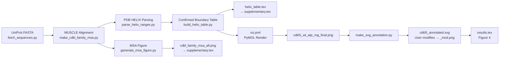

# CDKL5 Kinase Domain: Structural Validation & Annotation Pipeline

*Written: 2026-03-05 — Paul Shamrat*

---

## Background

CDKL5 (Cyclin-Dependent Kinase-Like 5) is a dual-specificity kinase whose loss-of-function mutations cause **CDKL5 Deficiency Disorder (CDD)**, a severe early-onset epileptic encephalopathy. Accurate structural annotation of the CDKL5 kinase domain is essential for mechanistically interpreting how missense mutations disrupt catalytic function.

The challenge: unlike CDK2 or ERK2, CDKL5 has both **canonical kinase core elements** (P-loop, αC, HRD, DFG, activation loop) and **CDKL-unique features** (the αG insertion and the αJ C-terminal docking helix absent in all non-CDKL kinases). We needed a fully reproducible, evidence-backed method for defining every secondary structure element's precise residue boundaries — and integrating those boundaries into both our molecular dynamics analysis and the manuscript.

---

## The Goal

Build a **single, self-contained pipeline** that:

1. Extracts crystallographic helix boundaries from Canning et al. 2018 PDB depositions
2. Validates them against a multiple sequence alignment of 8 kinases
3. Renders a publication-quality annotated 3D structure in PyMOL
4. Feeds the resulting table and MSA figure directly into the LaTeX manuscript — no manual copy-pasting

---

## Pipeline Overview



All scripts live in one unified directory:

```
manuscript/assets/cdkl5_structure_annotation/
```

---

## Step-by-Step Breakdown

### Stage 1 — Fetch Sequences

```bash
python fetch_sequences.py
```

Pulls the canonical kinase domain FASTA sequences from UniProt for 8 proteins:

| Protein | UniProt ID | Role |
|---|---|---|
| CDKL5 | O76039 | Target |
| CDKL1 | Q00532 | Canning 2018 crystal (4AGU) |
| CDKL2 | Q92772 | Canning 2018 crystal (4AAA) |
| CDKL3 | Q8IVW4 | Canning 2018 crystal (3ZDU) |
| CDKL4 | Q5MAI5 | CDKL family |
| CDK2 | P24941 | Canonical CMGC reference |
| ERK2/MAPK1 | P28482 | MAPK reference for αJ divergence |
| PKA-Cα | P17612 | AGC classical reference |

Output: `cdkl_kinase_family.fasta`

---

### Stage 2 — MUSCLE Alignment

```bash
python make_cdkl_family_msa.py
```

Runs **MUSCLE v5** to align all 8 sequences. Produces two alignment outputs:

- `cdkl_family_msa_only.png/svg` — CDKL1–5 only
- `cdkl_family_msa_all.png/svg` — Full 8-kinase ESPript-style figure *(used in manuscript Supplementary Figure S8)*

The MSA highlights residue-level conservation at all catalytic landmarks: K42, E60, D135 (HRD), D153 (DFG), Y171 (TEY).

---

### Stage 3 — Parse Crystallographic Helix Records

```bash
python parse_helix_ranges.py
```

This is the key validation step. The script:

1. **Auto-downloads** the four Canning 2018 PDB files from RCSB if not present:
   - `4AGU` (CDKL1), `4AAA` (CDKL2), `3ZDU` (CDKL3), `4BGQ` (CDKL5)
2. Reads every `HELIX` record from each PDB
3. Uses the MUSCLE alignment columns to map CDKL1/2/3 helix boundaries onto the CDKL5 sequence numbering
4. Identifies 14 confirmed helices directly from the 4BGQ crystal structure

Output: `helix_mapping.json`

!!! tip "Why this matters"
    Instead of relying on literature text alone, every boundary is traceable to a crystallographic `HELIX` record in a deposited PDB file. The mapping is reproducible from scratch with a network connection.

---

### Stage 4 — Build the Structural Boundary Table

```bash
python build_helix_table.py
```

Consolidates the confirmed boundaries with canonical motif definitions from literature:

- **Reinhardt 2023** — K42, E60, D135, Y171 residues
- **Dar 2011** — P-loop (14–21)
- **Haldane 2016** — DFG motif (153–155)
- **Canning 2018** — αG/αG1 CDKL-specific insert (215–228), αJ docking helix (281–299)

Outputs two files:

- `helix_table.md` — human-readable reference
- `helix_table.tex` — a complete LaTeX `\begin{table}...\end{table}` block directly injected into the manuscript via `\input{...}` *(Supplementary Table S4)*

---

### Stage 5 — Generate MSA Evidence Figure

```bash
python generate_msa_figure.py
```

Renders the full colored alignment figure with:

- Secondary structure bars derived from PDB 4BGQ
- Color-coded sequence backgrounds matching the PyMOL color scheme
- Explicit labeling of conserved catalytic residues

Results fed automatically into the supplementary via a direct path reference.

---

### Stage 6 — PyMOL Structure Render

```bash
pymol -cq viz.pml
```

**Input:** `cdl.com.wat.leap.pdb` — the minimized ATP–Mg-bound CDKL5 starting structure from the Amber LEaP MD setup pipeline (Hu2024 ATP–Mg parameters).

The PyMOL script colors each secondary structure element with a unique color matching the annotation scheme:

| Element | Color | Residues |
|---|---|---|
| P-loop | green | 14–21 |
| αC helix | orange | 54–67 |
| Catalytic loop (HRD/D135) | red | 133–135 |
| Activation loop | teal | 153–181 |
| TEY/Y171 | teal | 169–171 |
| ATP | hot pink | — |
| Mg²⁺ | forest green | — |
| αJ (CDKL-unique) | gold | 281–299 |

Output: `cdkl5_wt_atp_mg_final.png`

---

### Stage 7 — SVG Vector Annotation

```bash
python make_svg_annotation.py
```

Overlays color-matched typographic labels (using `svgwrite`) on top of the PyMOL PNG background. Produces:

- `cdkl5_annotated.svg` — the baseline annotated figure
- `cdkl5_annotated_preview.png` — raster preview

!!! note "Manual Finalization"
    The baseline `cdkl5_annotated.svg` was then manually refined and exported by the user as:
    
    - `cdkl5_annotated_mod.svg`
    - `cdkl5_annotated_mod.jpg`
    - **`cdkl5_annotated_mod.png`** ← *this is the file compiled into the manuscript as Figure 4*

---

## Manuscript Integration

| Output | Target | Location in Manuscript |
|---|---|---|
| `cdkl5_annotated_mod.png` | `results.tex` | **Figure 4** (Main Results) |
| `cdkl_family_msa_all.png` | `supplementary.tex` | **Figure S8** (Supplementary) |
| `helix_table.tex` | `supplementary.tex` via `\input` | **Table S4** (Supplementary) |
| `251110_atpbinding.jpg` | `supplementary.tex` | **Figure S† ATP Overlay** (Supplementary) |

The supplementary table and MSA figure are **dynamically linked** — running the pipeline scripts and building the manuscript PDF automatically updates them.

---

## Reproducibility

Run the entire pipeline from an empty folder:

```bash
cd manuscript/assets/cdkl5_structure_annotation

# Sequences + alignment + PDB parsing + table + MSA figure
python fetch_sequences.py
python make_cdkl_family_msa.py
python parse_helix_ranges.py
python build_helix_table.py
python generate_msa_figure.py

# 3D render (requires pymol-viz conda env)
~/miniforge3/envs/pymol-viz/bin/pymol -cq viz.pml

# SVG annotation overlay
~/miniforge3/envs/pymol-viz/bin/python make_svg_annotation.py

# Then rebuild the manuscript
cd ../../..  # → manuscript/
make
```

!!! warning "Manual modifications are separate"
    The above pipeline regenerates **baseline** figures. It does **not** overwrite `cdkl5_annotated_mod.png` or any `_mod.*` files — those are the user's manually edited graphics used in the manuscript.

---

## Key Files Reference

| File | Purpose |
|---|---|
| `fetch_sequences.py` | Download kinase FASTAs from UniProt |
| `make_cdkl_family_msa.py` | Run MUSCLE alignment, generate MSA figures |
| `parse_helix_ranges.py` | Parse PDB HELIX records, auto-download PDBs |
| `build_helix_table.py` | Generate `helix_table.md` and `helix_table.tex` |
| `generate_msa_figure.py` | Render colored ESPript-style alignment |
| `viz.pml` | PyMOL coloring and ray-trace render script |
| `make_svg_annotation.py` | SVG label overlay on rendered PNG |
| `cdl.com.wat.leap.pdb` | ATP–Mg-bound CDKL5 model from MD LEaP setup |
| `cdkl5_annotated_mod.png` | Final manuscript Figure 4 (user-edited) |
| `helix_table.tex` | Self-contained LaTeX table for `\input` |
| `cdkl_family_msa_all.png` | Supplementary MSA figure |
| `README.md` | Full historical documentation of the pipeline |

---

## References

- Canning P. et al. (2018) *Cell Rep.* — CDKL1/2/3/5 crystal structures (4AGU, 4AAA, 3ZDU, 4BGQ)
- Reinhardt P. et al. (2023) *eLife* — CDKL5 variant effects, K42/E60/D135/Y171 residues
- Dar A.C. & Shokat K.M. (2011) *Annu. Rev. Biochem.* — Kinase domain anatomy
- Haldane A. et al. (2016) *Protein Sci.* — DFG motif energetics
