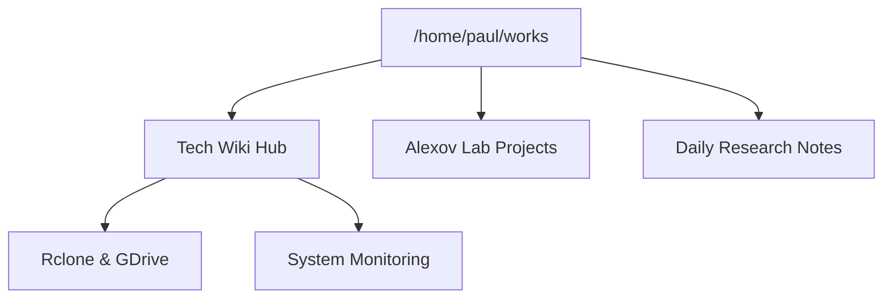

# 🛠️ Aletheia

Welcome to your local research & engineering wiki. This is your central hub for technical guides, infrastructure notes, and lab protocols.

---

## 🚀 Quick Access Dashboard

| Category | Description | Link |
| :--- | :--- | :--- |
| **📂 Data Sync** | Google Drive & rclone setup (personal keys) | [Rclone Guide](./rclone_setup_guide.md) |
| **📊 Monitoring** | Performance monitoring & shortcuts | [Monitoring Guide](./linux_system_monitoring.md) |
| **🧊 Palmetto HPC** | Clemson HPC connection and usage | [Palmetto Guide](./palmetto_hpc.md) |
| **🐍 Python** | Environment management and Conda tips | [Python Guide](./python_conda.md) |
| **🧬 Lab Work** | Alexov Lab protocols and files | [Alexov Lab](../../alexovlab/) |
| **📓 Daily Progress** | Your chronological research notes | [Daily Notes 2025](../../daily-notes.md) |

---

## 🧠 Knowledge Map

---

## 📖 How to use this Wiki
- **Navigation**: Click the links above to jump to specific guides.
- **Search**: Use `Ctrl+Shift+F` in VS Code to search across all your documentation.
- **Editing**: Just edit any Markdown file. Your changes are saved instantly!

> [!TIP]
> Keep this folder synced with Google Drive using the `rclone` commands in the **Data Sync** guide to ensure your wiki is backed up!

---

## 🛠️ Maintenance
- **Start the Server**: Just type `wiki` in any terminal!
- **Update Content**: Just edit the files in the `docs/` folder. The website updates automatically!

---
*Last updated: 2026-03-03*
