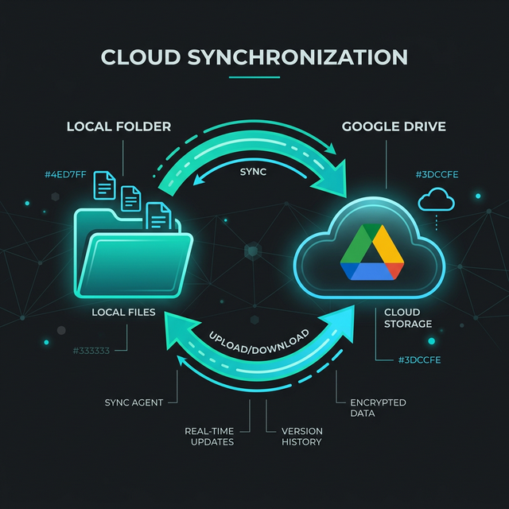

# Rclone Google Drive Setup & Sync Guide



This is your personal guide for managing Google Drive synchronization on this machine.

## 1. Credentials (Your Private Tunnel)
We have configured `rclone` to use your own Google Cloud Project. This stops the "daily logout" issue.

--8<-- "docs/internal/rclone_secrets.md"

### How to create your own Client ID & Secret
If you ever need to create a new set of keys from scratch, follow these steps:

1.  **Google Cloud Console**: Go to the [Google Cloud Console](https://console.cloud.google.com/).
2.  **Create Project**: Click the project dropdown at the top and select **"New Project"**. Give it a name like `rclone-paul`.
3.  **Enable API**: In the search bar, type **"Google Drive API"** and click **Enable**.
4.  **Configure OAuth Consent**:
    - Go to **APIs & Services** > **OAuth consent screen**.
    - Choose **"External"** and click **Create**.
    - Fill in the **App name** (e.g., `rclone`) and your **User support email**.
    - Add your email to the **Developer contact information**.
    - Click **Save and Continue** until you reach the dashboard.
5.  **Create Credentials**:
    - Go to **APIs & Services** > **Credentials**.
    - Click **+ Create Credentials** > **OAuth client ID**.
    - Select **"Desktop app"** as the Application type.
    - Name it `rclone-paul` and click **Create**.
6.  **Get the Keys**: A popup will show your **Client ID** and **Client Secret**. Copy these into this guide!

### How to re-authenticate (if needed)
If you ever get an "Authorization failed" error, run:
```bash
rclone config reconnect gdrive:
```
1. Type **y** to refresh the token.
2. Type **y** for auto-config.
3. In the browser, log in with `shamrap@g.clemson.edu`.
4. Click **Advanced** > **Go to rclone (unsafe)** > **Allow**.

---

## 2. Daily Workflow (Your Duty)
To keep your files synced, you should follow this routine:
- **After significant local changes**: Run the **"Upload"** command to back up your work.
- **Before starting work**: Run the **"Download"** command if you think you changed files on another device.

### Step 1: Clean Up Duplicates
Google Drive sometimes creates multiple files with the same name. Run this to fix it automatically:
```bash
rclone dedupe gdrive:works --dedupe-mode largest -P
```

### Step 2: Sync Your Work
- **To Upload (Local -> Cloud)**:
  ```bash
  rclone copy /home/paul/works gdrive:works -P
  ```
- **To Download (Cloud -> Local)**:
  ```bash
  rclone copy gdrive:works /home/paul/works -P
  ```

**Note**: I recommend using `copy` instead of `sync`. `copy` is safer because it never deletes files; it only adds new ones.

## 4. Speed Tips (Save Time)
If checking all 30,000 files takes too long (e.g., 4-5 minutes), use these tricks:

### Trick 1: Sync Only Your Active Project
Instead of syncing all of `works`, only sync the folder you are actually using today:
```bash
rclone copy ~/works/alexovlab/YOUR_PROJECT gdrive:works/alexovlab/YOUR_PROJECT -P
```

### Trick 2: Use Fast-List
This tells Google Drive to send the file list in larger chunks, which can cut the "Checking" time in half:
```bash
rclone copy /home/paul/works gdrive:works --fast-list -P
```

## 5. Helpful Tips
- **Check first**: Run `rclone check /home/paul/works gdrive:works --size-only` to see what is different without changing anything.
- **Progress**: Always use `-P` to see how much data is being transferred.
